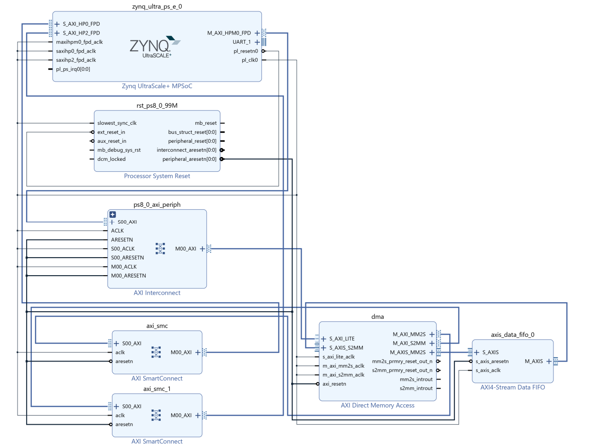
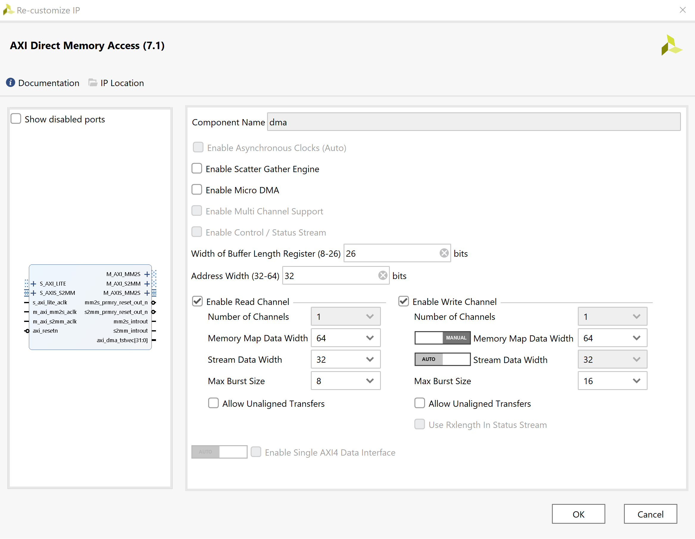
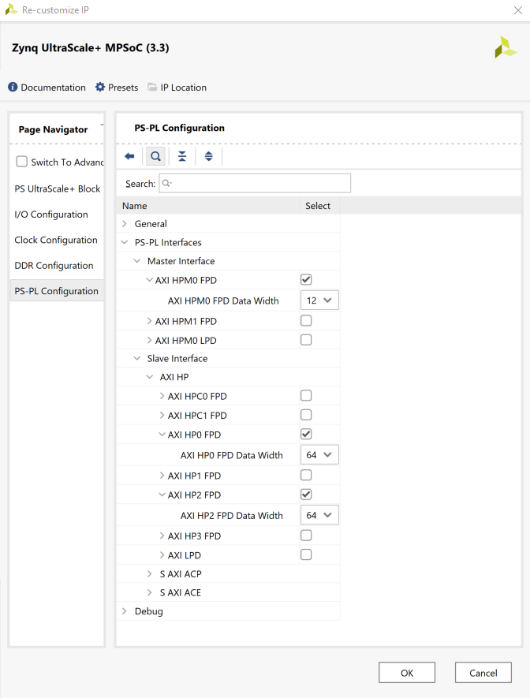

# DMADemo
ZCU111 AXI DMA Demonstration
* **Overview**
    - This is a demonstration of using Xilinx AXI-DMA firmware and drivers 
    - It is based on https://discuss.pynq.io/t/tutorial-pynq-dma-part-1-hardware-design/3133
    - This is implemented for the ZCU111 demonstration board and pynq v2.7
    

* **Get Started**

    - Clone this repository and copy it to a folder on your ZCU111.  
    - Run the notebook DMADemoClass.ipynq

* **Build Firmware**
    - The file DMADemo.tcl was exported from Vivado 2020.2.  
    - Source it in Vivado 2020.2 tcl to create the project
    - This creates the projec in DMADemo.xpr.  Open that in Vivado
    - Click on "Generate Bitstream" and wait 5 to 10 minutes for it to complete
    - the bitfile is written to ./DMADemo.runs/impl_1/design_1_wrapper.bit
    - the hwh file is written to ./DMADemo.gen/sources_1/bd/design_1/hw_handoff/design_1.hwh
    
* **Run Demonstration**
    - copy these to the pynq directory and rename DMADemo.bit and DMADemo.hwh
    - transfer the pynq directory to the ZCU111 and run the notebook DMSDemoClass.ipynb
    
* **Block Design**

Here is the top level block diagram:

---

Here are the settings for the AXI DMA block:

---

Here are the settings for the Zynq Ultrascale block:

